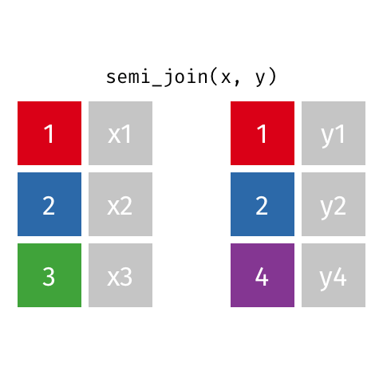
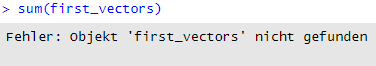
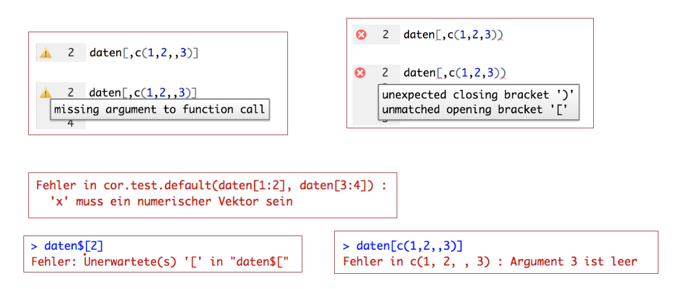
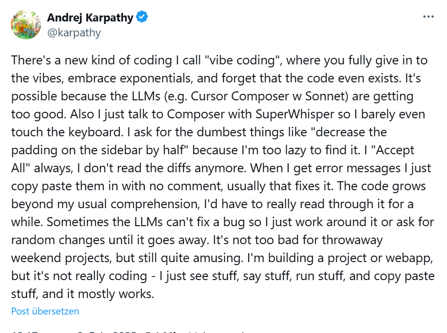
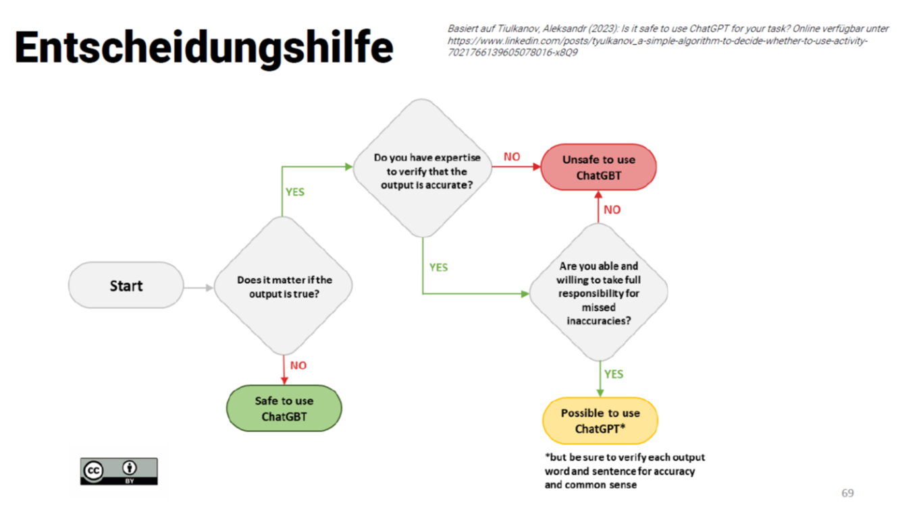

## R u Ready? Reproduzierbare Datenaufbereitung und -analyse mit R

HS 2025<br><br><br> **LV-Leitung**: Dr. Sandra Grinschgl / MSc. Aaron Friedli<br> **Tutor**: BSc. Lars Schilling<br><br><br>**4. Einheit**, 8.10.2025

------------------------------------------------------------------------

## Fragen zum Datenanalyseplan & Codebook:

{fig-align="center"}

------------------------------------------------------------------------

## Heute:

<iframe src="PDFs/Syllabus.pdf" width="100%" height="600px">

</iframe>

------------------------------------------------------------------------

## Hands On!

🎯 **Ziel:** Heute mindestens bis zum Daten-Mergen und Speichern kommen!

🏃 **Für alle, die schneller fertig sind:** Coding Basics, Funktionen und Styler

✈️ **Für besonders Schnelle:** Weiterarbeiten am Codebook / Peer-Feedback

------------------------------------------------------------------------

## Daten einlesen

-   Code immer im Skript abspeichern!

-   Ausführung alleine in der Konsole reicht nicht

-   Bei Einlesen über Environment, Code in Skript kopieren!

------------------------------------------------------------------------

## Plenum: **Wie funktionieren Joins?**

::: notes
Fragen wie weit man letzte Einheit gekommen ist, ggf. zuerst weiter arbeiten lassen
:::

-   `cbind()` vs. `full_join()`

-   `cbind()` verbindet Datensätze spaltenweise – warum ist das suboptimal?

-   `full_join()` Nimmt alle Variablen aus beiden Datensätzen. Um die Datensätze korrekt zu verbinden musst du einen *Schlüssel* festlegen.

{fig-align="center" width="238"}

------------------------------------------------------------------------

## full_join()

**Was ist der Schlüssel?**

Eine gemeinsame Variable die in beiden Datensätzen vorhanden ist, mit der RStudio erkennen kann welche Werte miteinander verbunden werden müssen.

```{r, echo = FALSE}

library(tidyverse)
```

```{r echo=TRUE}

data_cb <- read_delim("data/raw/data_cb.csv", delim = ";")
data_vp <- read_delim("data/raw/data_vp.csv", delim = ";")

dat_full_1 <- full_join(data_cb, data_vp, by = "code")
head(dat_full_1)
```

::: notes
Iterativer Prozess: immer für 2 Datensätze bis man dat_full mit allen 7 Datensätzen hat –\> dafür wird dann Codebook geschrieben
:::

------------------------------------------------------------------------

## Beispiel

```{r echo=TRUE}
df1 <- data.frame(id = c(1, 2, 3),
                  name = c("Anna", "Ben", "Chris"))

df2 <- data.frame(id = c(2, 3, 4),
                  score = c(80, 90, 70))

full_join(df1, df2, by = "id")

```

------------------------------------------------------------------------

## Unterschiede zwischen den diversen Joins:

::: notes
Behält gemeinsame Zeilen bei
:::

{fig-align="center"}

------------------------------------------------------------------------

## Unterschiede zwischen den diversen Joins:

::: notes
Behält gemeinsame + Zeilen von linken Datensatz bei
:::

{fig-align="center"}

------------------------------------------------------------------------

## Unterschiede zwischen den diversen Joins:

::: notes
Behält gemeinsame + Zeilen von rechten Datensatz bei
:::

{fig-align="center"}

------------------------------------------------------------------------

## Unterschiede zwischen den diversen Joins:

::: notes
Behält gemeinsame Zeilen, aber nur Inhalte von Datensatz x bei
:::

{fig-align="center"}

------------------------------------------------------------------------

## Check-in:

-   Nun sollte jede/r einen Datensatz *dat_full* haben, der alle 7 Einzeldatensätze beinhaltet mit **159** **Versuchspersonen (= Zeilen) und 36 Variablen (= Spalten).**

-   Checkt mit euren Peer-Partner:innen/Sitznachbar:innen!

-   Mit diesem Datensatz werden wir die Analysen von Grinschgl et al. (2020) durchführen.

-   Zu diesem Datensatz sollt ihr bis zum **22.10.** den ersten Entwurf für das Codebook schreiben!

------------------------------------------------------------------------

## Fehlererkennung in R

***Der Code läuft nicht. Wie könnt ihr vorgehen um den Fehler zu identifizieren und beheben?***

-   Lies die **Fehlermeldung!**

{width="477"}

Überprüfe:

✅Tippfehler

✅Klammern

✅Syntaxfehler

✅Datentypen

✅Pakete

Googeln hilft oft weiter!\

Fehlermeldungen lassen sich einfacher googeln, wenn R auf Englisch eingestellt ist:

-   👉`Sys.setenv(LANGUAGE = "en")`
-   oft ist es auch hilfreich, das Betriebssystem anzugeben: `sessionInfo()`

::: notes
:::

------------------------------------------------------------------------

## Fehlererkennung in R – Tipps

-   `class()` / `str()` zur Objektprüfung 👉

    ```         
    In mean.default(x) : argument is not numeric or logical: returning NA
    ```

-   Funktionen schrittweise testen

-   Argumente weglassen → Fehlerquelle finden

-   Zwischenergebnisse mit `print()`

------------------------------------------------------------------------

## Code Diagnostik:

{fig-align="center"}

------------------------------------------------------------------------

## R-Studio gibt Hinweise!

{fig-align="center"}

::: notes
Fehlermeldungen: Die Information vor dem Doppelpunkt gibt uns an, in welcher Funktion der Fehler steckt; die Information nach dem Doppelpunkt gibt Aufschluss über die Art des Fehlers. Zweiteres ist für die Fehlersuche (zumeist) von großer Bedeutung.

Wenn ein oder mehrere Zeichen überflüssig sind bzw. fehlen, dann bekommt man Unerwartete(s) '...' in "..." ausgegeben. Hierbei teilt uns die Meldung mit, wo der Fehler liegt: In den Anführungszeichen "..." wird nur ein Teil des Codes ausgegeben und der Fehler ist zumeist das zuletzt ausgegebene Zeichen (oder es liegt unmittelbar davor).  z.B. daten\[2\]
:::

------------------------------------------------------------------------

## R-Resourcen

-   [Newsletter zu R](https://rweekly.org/)

-   [Informationen zu Paketen](https://cran.r-project.org/web/packages/available_packages_by_name.html)

-   [Psyteacher](https://psyteachr.github.io/AITutoR/) AI Tutor

-   [R for Data Science](https://r4ds.hadley.nz/) (Basics wie Import, Aufbereitung, Visualisierung)

-   [Psychometrics in Exercises using R and RStudio](https://bookdown.org/annabrown/psychometricsR/) (Psychometrische Analysen wie EFA, CFA, SEM)

-   [Learnr Shinyapps](https://learnr-examples.shinyapps.io/ex-data-filter/#section-welcome)

-   [Cheatsheets](https://posit.co/resources/cheatsheets/)

-   [Stack Overflow](https://posit.co/resources/cheatsheets/) –\> Q&A Forum

-   [Datacamp](https://www.datacamp.com/)

-   Überblick über weitere Ressourcen 👉 [Arslan (2025)](https://rubenarslan.github.io/posts/2025-06-04-resources-for-learning-r/)

------------------------------------------------------------------------

## Large Language Models & Datenanalyse

-   Modelle wie ChatGPT

-   Berechnen Wahrscheinlichkeiten für Wörter und erzeugen dadurch Text, der menschlich wirkt.

-   ABER:

    -   Verstehen keine Bedeutung

    -   Wissen nicht was inhaltlich korrekt ist

{fig-align="center" width="300"}

::: notes
Für welche Aufgaben nutzt du LLMs im Analyseprozess?
:::

------------------------------------------------------------------------

## Vibe coding

{fig-align="center"}

👉KI in natürlicher Sprache prompten ohne den generierten Code zu prüfen oder zu verstehen.

::: notes
**Vibe Coding** bedeutet, dass Nutzer\*innen mit **KI-Codegeneratoren (z. B. ChatGPT, GitHub Copilot)** Programme schreiben, indem sie **nur Zielbeschreibungen in natürlicher Sprache eingeben**, ohne den generierten Code wirklich zu verstehen oder gründlich zu überprüfen.\

Es ist also **intuitives, versuchsorientiertes „Codieren nach Gefühl“**, bei dem **Schnelligkeit vor Verständnis** steht.
:::

------------------------------------------------------------------------

## Gefahren von Vibe coding

{fig-align="center" width="351"}

::: notes
Welche Chancen und Risiken siehst du bei der Nutzung von LLMs bei der Datenanalyse?
:::

------------------------------------------------------------------------

## KI - LLMs (ChatGPT, Copilot, Rtutor)

💚 **Vorteile**

-   Generieren schnell viel Code

-   Code häufig syntaktisch korrekt

-   On-Demand-Assistenz für Fragen aller Art

-   Reduziert Einstiegshürden

-   Unterstützung bei Debugging und Error Handling

-   **Tutoring-Funktion** –\> siehe [Prompts](https://learnius.com/llms/5+Prompting/Examples/AI+tutor+by+Ethan+Mollick+with+Claude+2)

------------------------------------------------------------------------

💔 **Nachteile**

-   Unreflektiert Code übernehmen → Lerneffekt sinkt

-   Keine Garantie für Korrektheit → Code kann plausibel wirken, aber methodisch unangemessen sein.

-   Overreliance / Cognitive Offloading → Reduziertes Verständnis dessen, was man tut

-   Nicht immer Best-Practice-Beispiele → Verletzung wissenschaftlicher Standards

-   "Fast but Flawed"

-   ⚠️Datenschutz: Niemals sensible Daten in LLMs hochladen ⚠️

::: notes
-   Beispiel: unreflektiert ChatGPT fragen, ob ich eine Mediationsanalyse machen kann → Code übernehmen, Output interpretieren lassen, Diskussion schreiben lassen → Rezept für ein Desaster.

-   Datenanalyse darf keine Blackbox sein → Die Schritte der Analyse müssen mindestens für die Person, die sie durchführt, nachvollziehbar sein.

<!-- -->

-   Datenschutz: unklar, wo Daten gespeichert werden; Risiko von Training Leakage und rechtlichen Verstössen!
:::

------------------------------------------------------------------------

## Sinnvolle Nutzung von KI im Datenanalyseprozess:

-   **💚Sinnvoll: Unterstützend – nicht ersetzend**

    -   Kontrolle einfacher Fehler (Klammern, Typos)
    -   Erklärung von Code und Syntax
    -   Hilfe bei Fehlersuche (Debugging)
    -   Kommentierung und Dokumentation

-   **💔Nicht sinnvoll: Ersatz statt Unterstützung**

    -   Generierung ganzer Analyse-Skripte

    -   Automatische Auswahl von Methoden oder Tests

    -   Interpretation statistischer Ergebnisse durch KI

    -   Erstellung kompletter Berichte oder Diskussionen

    -   Hochladen sensibler Daten

    -   Unkritisches Übernehmen von Output

------------------------------------------------------------------------

## Github CoPilot in R

-   Voraussetzung ist ein **Account** sowie ein **Copilot-Abo** (kostenlos für Studierende) auf **GitHub**.\
    GitHub ist ein **Clouddienst von Microsoft**, spezialisiert auf das Teilen und gemeinsame Bearbeiten von Code:

    <https://github.com/>

-   Eine **Anleitung zur Einrichtung von GitHub Copilot in RStudio** findet ihr hier:\
    [YouTube-Link (1:40–2:36)](https://www.youtube.com/watch?v=t7NrkAeosog)

-   **Rechtliche Informationen** für Studierende der Universität Bern findet ihr unter:\
    [Generative KI Uni Bern](https://www.unibe.ch/universitaet/campus__und__infrastruktur/rund_um_computer/soft_und_hardware/software/generative_kis/index_ger.html){.uri}\

------------------------------------------------------------------------

## ChatGPT in R

-   Voraussetzung ist ein **Account bei OpenAI / ChatGPT**:\
    <https://chatgpt.com/>

-   Eine **Anleitung zur Einrichtung von ChatGPT in RStudio** findet ihr hier:\
    [YouTube-Link (2:36–5:08)](https://www.youtube.com/watch?v=t7NrkAeosog)

-   **Rechtliche Informationen** für Studierende der Universität Bern findet ihr unter:\
    [Generative KI Uni Bern](https://www.unibe.ch/universitaet/campus__und__infrastruktur/rund_um_computer/soft_und_hardware/software/generative_kis/index_ger.html){.uri}

------------------------------------------------------------------------

## Verwendung von LLMs



------------------------------------------------------------------------

## Peer Feedback zum Datenanalyseplan

📋To Do's:

-   Musterlösung anschauen! (siehe Ordner Abschlussprojekt auf Ilias)

-   Datenanalyseplan des Partners/der Partnerin bis 15.10. durchschauen und kommentieren (am besten mit Word oder PDF Kommentaren)

-   Upload auf Ilias mit Kommentaren+ Weitergabe an Partner:in per Email

-   Auch persönliches Feedback erwünscht 👉 selbstorganisiert

    *Selbständigkeit:* Wir geben kein Feedback, bei Fragen auf uns zukommen (Forum, Sprechstunde etc. nutzen)

{fig-align="center" width="177"}

------------------------------------------------------------------------

## Peer Feedback zum Datenanalyseplan

-   Klarheit und Verständlichkeit (z.B. sind alle Begriffe und Konzepte ausreichend erklärt? Gibt es verwirrende oder unklare Formulierungen?)

-   Vollständigkeit (z.B. wurden alle notwendigen Fragen ausreichend beantwortet? Fehlen Informationen?)

-   Reproduzierbarkeit (Ist der Plan so formuliert, dass er von einer anderen Person nachvollzogen und reproduziert werden kann?)

------------------------------------------------------------------------

## Peer Feedback Regeln

-   Gib fundiertes, konstruktives und gut strukturiertes Feedback!

-   Fokus sollte auf inhaltlicher Qualität und Übereinstimmung mit den Anforderungen liegen, nicht auf persönlichen Präferenzen.

-   Verbesserungsvorschläge sind gewünscht, kein „Schön reden“ notwendig –\> wir wollen dazu lernen!

-   Verbesserungsvorschläge sollten möglichst konkret sein.

-   Bleibt aber natürlich sachlich und verwendet eine respektvolle Sprache!

-   Auch Lob für besonders gute Abschnitte darf nicht fehlen. Feedback ist ein Lernprozess, auch für den Gebenden. Seit bereit, euer Feedback anzupassen, wenn die andere Person es anders versteht oder weitere Informationen liefert.

-   Peer Feedback sollte nicht nur auf die aktuelle Aufgabe abzielen, sondern auch helfen, den Lernprozess der beteiligten Personen langfristig zu verbessern

------------------------------------------------------------------------

## Heute haben wir:

-   Datensätze gemerged und diverse `joins` kennengelernt

-   Tools für die Fehlerdiagnostik in R kennengelernt

-   Uns mit Ressourcen und dem Umgang mit LLMS befasst

------------------------------------------------------------------------

## Abfrage Muddiest Points

-   Denke an die bisher besprochenen Inhalte zurück – was ist dir unklar geblieben? Was sollten wir noch einmal besprechen?

-   Denke sowohl an die R Hands On Sessions als auch die theoretischen Inhalte (z.B. Open Science, Datenanalyseplan, Codebook).

-   Notiere bitte max. drei konkrete Punkte. Falls du Vorschläge/Ideen zur Aufarbeitung dieser Punkte hast, gib diese auch gerne an.

-   Umfrage auf ILIAS (siehe EH 4) bis **Sonntag 12.10. 23:55**

------------------------------------------------------------------------

## Zusammenfassung der To Do's

-   Muddiest Points Umfrage bis Sonntag 23:55

-   Peer Feedback Datenanalyseplan bis Mittwoch

-   Selbstständiges Durcharbeiten des Hands On Block 2 bis Mittwoch

------------------------------------------------------------------------

## Referenzen:

Arslan (2025, June 4). One lives only to make blunders: Resources for learning R. Retrieved from <https://rubenarslan.github.io/posts/2025-06-04-resources-for-learning-r/>
