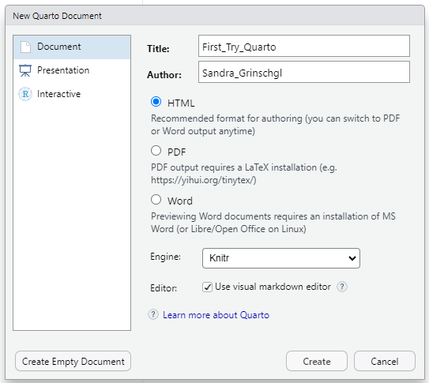
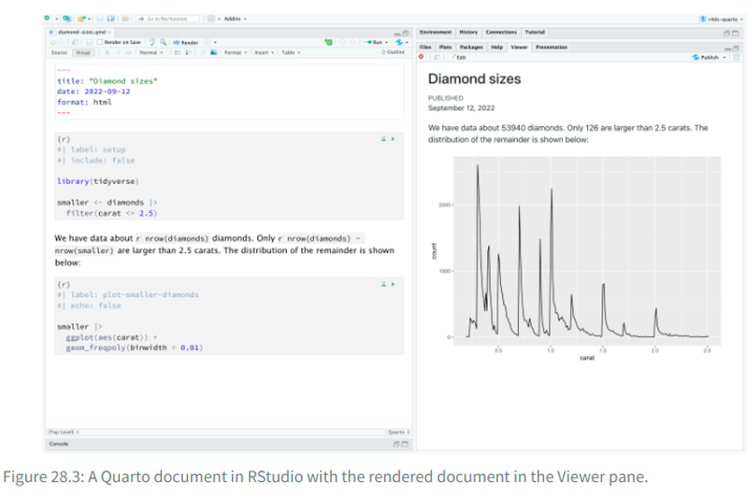

```{r}
#| include: false
#| eval: true

library(dplyr)
library(readr)
```

# Lösung - Tidy & Transform (Einheiten 5 und 6)

Bei Bedarf findest du hier nochmals die Slides zu Einheit 5:\

<iframe src="EH_5.html" width="100%" height="500px">

</iframe>

# Lernziele des Hands-On-Blocks 3

✅Basics Reproduziebarer Code

✅Quarto

✅Faktoren

✅Datentypen: Vektoren, Listen, Matrizen, Dataframes

# Reproduzierbarer Code: Quarto

👉[R for Datascience, Kapitel 28](https://r4ds.hadley.nz/quarto.html)

Bisher haben wir hauptsächlich in Skripten gearbeitet. RStudio bietet jedoch die Möglichkeit, in einem **reproduzierbareren Format** zu arbeiten – 👉 **Quarto**.

Quarto verbindet normalen Text und Code in einem dynamischen Dokument. Auch diese Website wurde mit Quarto erstellt. Dadurch lässt sich die Kommentierung von Code besser integrieren, was die Arbeit insgesamt reproduzierbarer macht. Mit Quarto können zudem ganze Dokumente erstellt werden, beispielsweise eine Masterarbeit.

In den folgenden Übungen setzen wir uns mit einigen der **Vorteile von Quarto** auseinander.

## Übungen:

-   Erstelle ein neues Quarto-Skript:



-   Versuche dich zu orientieren: Wie wechselst du zwischen dem **Visual** und **Source Editor**?

::: {.callout-note collapse="true" title="Lösung"}
Oben links unterhalb des Symbols zum Speichern finden sich zwei Buttons, `Visual` und `Source`. Mit einem Klick auf einen der beiden Buttons wechselt man die Ansicht. In der Ansicht `Source` (auch Source Editor genannt) seht ihr immer den grundlegenden Code. In der Ansicht `Visual` (auch Visual Editor gennant) wird der Code in eine ansprechendere Form gebracht, die dem gerenderten Dokument ähnelt. Bilder und Formatierungen sind hier beispielsweise schon geladen und werden entsprechend angezeigt.
:::

-   **Erstelle eine Überschrift:**

    -   Suche zuerst nach der entsprechenden Option im **Visual Editor**.

::: {.callout-note collapse="true" title="Lösung"}
Ähnlich wie ihr es aus Word kennt, könnt ihr oben in einem Menü, neben den Buttons für `Source` und `Visual`, in der Ansicht von `Visual` euren Text formatieren.
:::

-   Schau dir anschließend die Überschrift im **Source Editor** an. Wie unterscheiden sich Überschriften von normalem Text?

::: {.callout-note collapse="true" title="Lösung"}
Überschriften werden im Source Editor mit einer Raute (#) am Anfang der Zeile gekennzeichnet. Je mehr Rauten, desto niedriger die Überschriftebene (z. B. `#` für Ebene 1, `##` für Ebene 2, etc.). Normaler Text hat keine Raute davor.
:::

-   Schreibe einige Dinge in *kursiv*, **fett**, [unterstrichen]{.underline}, Schaue dir diese im Source Editor an.

::: {.callout-note collapse="true" title="Lösung"}
*kursiv*

**fett**

<u>unterstrichen</u>
:::

-   Rendere deine Datei indem du den Button "Render" verwendest. Schaue dir das Resultat an.

::: {.callout-note collapse="true" title="Lösung"}
Den Button zum Rendern findet ihr oben direkt über den Formatierungsoptionen unter `Render`.
:::

## Code Chunks

📖 [R4DS Kapitel 28.5.1](https://r4ds.hadley.nz/quarto.html#code-chunks)

Für weitere Informationen, konsultiere das [Quarto Cheatsheat](https://rstudio.github.io/cheatsheets/quarto.pdf) und die [Quarto Website](https://quarto.org/).

-   **Erstelle einen neuen Code-Chunk:**

    -   Versuche es im **Visual Editor**, indem du ein „/“ eingibst und im Drop-down-Menü **„R-Code Chunk“** auswählst

::: {.callout-note collapse="true" title="Lösung"}
Du kannst einen neuen Code-Chunk erstellen, indem du im Visual Editor ein `/` eingibst und dann im erscheinenden Menü `R-Code Chunk` auswählst. Alternativ kannst du auch den Shortcut `Ctrl + Alt + I` (Windows) oder `Cmd + Option + I` (Mac) verwenden.
:::

-   Gib deinem Code-Chunk ein "Label" (📖 [R4DS Kapitel 28.5.1](https://r4ds.hadley.nz/quarto.html#code-chunks)).

::: {.callout-note collapse="true" title="Lösung"}
```{r mein_erster_chunk}
#| label: mein_erster_chunk
```

Ihr könnt den Namen des Chunks über beide Wege angeben, oben innerhalb der {} oder darunter mit der entsprechenden Syntax. Namen von Chunks dürfen keine Leerzeichen oder Sonderzeichen enthalten.
:::

-   Manchmal will man nicht alle Teile des Skripts in das gerenderte Dokument übernehmen. Erstelle einen neuen Code-Chunk und stelle `eval` und `include` auf FALSE.

::: {.callout-note collapse="true" title="Lösung"}
```{r }
# #| eval: false
# #| include: false
```

`eval: false` verhindert, dass der Code ausgeführt wird. `include: false` verhindert, dass der Code und dessen Ausgabe im gerenderten Dokument angezeigt werden. Damit in der gerenderten Lösungsdatei der Chunk normal angezeigt wird, habe ich die Optionen auskommentiert.
:::

-   **Kreiere eine neue Variable `datum`** mit dem heutigen Datum. Nutze dafür `Sys.Date()`.

::: {.callout-note collapse="true" title="Lösung"}
```{r }
datum <- Sys.Date()
```
:::

## Inline Code

-   **Füge folgenden dynamischen Satz in dein Dokument ein:** „*Dieses Dokument wurde zum letzten Mal am `datum` bearbeitet.*“

-   Benutze dafür die Variable `datum` die du bereits kreiert hast. Diese kannst du hinzufügen indem du "/" benutzt und "Inline R Code" suchst.

::: {.callout-note collapse="true" title="Lösung"}
Dieses Dokument wurde zum letzten Mal am `r datum` bearbeitet.
:::

-   **Rendere dein erstes Dokument:** Stelle ganz oben in deinem Dokument dafür das Format um.

::: {.callout-note collapse="true" title="Lösung"}
Übliche Formate sind html, docx oder pdf.
:::

-   Nutze dafür den **Render-Button** und schau dir das gerenderte Ergebnis an. Was ist mit deinem dynamischen Satz passiert?

::: {.callout-note collapse="true" title="Lösung"}
Beim Rendern des Dokumentes wird der Inline-Code ausgeführt und das aktuelle Datum (bzw. grundsätzlich das entsprechend zuvor definierte Objekt) an der entsprechenden Stelle im Satz eingefügt.
:::

*Das Resultat sollte so aussehen (mit dem aktuellen Datum):*

```{r, echo=FALSE}
datum <- Sys.Date()
```

Dieses Dokument wurde zum letzten Mal am `r datum` bearbeitet.

::: callout-important
Quarto-Dokumente lassen sich nur rendern, wenn das gesamte Skript fehlerfrei durchläuft. Tritt beim Rendern ein Fehler auf, ist es sinnvoll, das gesamte Skript auszuführen und auf Fehlermeldungen zu achten. Auf diese Weise wird die **Reproduzierbarkeit** sichergestellt.

Möchte man das Skript trotz eines Fehlers rendern, kann man an den entsprechenden Code-Chunk `#| eval: false` schreiben - dies verhindert, dass der Code für die gerenderte Datei ausgeführt wird.
:::

## Quarto Header

In den Code Chunks hast du bereits einige Einstellungen kennengelernt. In den **Quarto-Headern** lassen sich verschiedene Einstellungen vornehmen.\
Beispielsweise kann man den **Output des Dokuments** anpassen (z. B. `format: html` `format: docx` `format: pdf`).

Manchmal möchte man auch **globale Einstellungen** vornehmen, die für das gesamte Dokument gelten.\
Zum Beispiel kann es sinnvoll sein, **Warnmeldungen von R** im gerenderten Dokument auszublenden, um die Übersicht zu behalten.\
Dies lässt sich mit der Option `warning: false` einstellen.

-   Versuche den Quarto Header so zu verändern das du ein Word oder Pdf renderst.

Viele weitere Einstellungsmöglichkeiten findest du unter folgendem [Link](https://quarto.org/docs/reference/formats/html.html).



### Übungen Quarto Header

Stelle in deinem Quarto Header die folgenden Einstellungen ein indem du die Elemente des YAML-Headers überarbeitest. Diesen findest du ganz oben in deinem Dokument. Dafür kannst du den Code-Block unten kopieren und für deinen Header anpassen.

-   Titel

-   Autor:in

-   Inhaltsverzeichnis (toc) = TRUE

-   Position des Inhaltsverzeichnisses = left

-   Warning = FALSE

-   Message = FALSE

-   <div>

    </div>

```{r, eval=FALSE, echo=TRUE}
    title: 'Gib hier den Namen deines Dokuments ein'
    author: 'Dein Name'
    date: today
    format:
      html:
        theme: flatly
        toc:   # Inhaltsverzeichnis?
        toc-location:  # Links oder Rechts?
    execute:
      warning:  # TRUE or FALSE
      message: # TRUE or FALSE

```

```         
</div>
```

::: {.callout-note collapse="true" title="Lösung"}
```{r, eval=FALSE, echo=TRUE}
    title: 'Hands-on Block 3'
    author: 'Lars Schilling'
    date: "`r Sys.Date()`"
    format:
      html:
        theme: flatly
        toc: true
        toc-location: left
    execute:
      warning:  false
      message: false
```
:::

**Aufgabe:** Rendere das Dokument erneut und überprüfe das gerenderte Ergebnis im Vorschaufenster oder im Ausgabeordner.

# Faktoren (Spezialtyp eines Vektors):

👉[Einführung in R, Kapitel 2.4.4](https://methodenlehre.github.io/einfuehrung-in-R/chapters/02-R-language.html#factors)

***Aufgabe: Arbeiten mit kategorialen Variablen (Faktoren)***

Kategoriale bzw. nominale Variablen werden in R als **Faktoren** gespeichert (`factor`-Datentyp).

-   **Erstelle** einen Character-Vektor mit mindestens fünf Einträgen, die verschiedene Geschlechtskategorien enthalten (z. B. *"male"*, *"female"*, *"nonbinary"*).

::: {.callout-note collapse="true" title="Lösung"}
```{r}
character_vektor <- c("male", "female", "nonbinary", "female", "male")
```
:::

-   **Definiere** nun einen Faktor mit der Funktion `factor()` für diesen Vektor.

::: {.callout-note collapse="true" title="Lösung"}
```{r}
factor_vektor <- factor(character_vektor)
    
# Alternativ hätte man auch direkt einen Faktor erstellen können:
factor_vektor <- factor(c("male", "female", "nonbinary", "female", "male"))
```
:::

-   **Untersuche** die Eigenschaften deines Faktors mit den Funktionen `class()`, `attributes()` und `table()`.

::: {.callout-note collapse="true" title="Lösung"}
```{r}
class(factor_vektor)
attributes(factor_vektor)
table(factor_vektor)
```

Mit `class()` kannst du den Datentyp überprüfen, `attributes()` zeigt dir die Metadaten des Faktors (wie Levels) und `table()` gibt dir die Häufigkeitsverteilung der Kategorien.
:::

**Beachte:** Die erste Stufe des Faktors ist die sogenannte **Referenzkategorie** – sie ist für manche Analysen relevant. Mit `relevel()` kannst du die Referenzkategorie ändern.

::: {.callout-note collapse="true" title="Lösung"}
```{r}
relevel(factor_vektor, ref = "female") # welche Kategorie als Referenz dienen soll hängt von der Fragestellung und vom Design ab
```
:::

# Datenstrukturen: Vektoren, Listen, Matrizen und Data Frames

👉[Einführung in R, Kapitel 2.4](https://methodenlehre.github.io/einfuehrung-in-R/chapters/02-R-language.html#datentypen)

Bevor wir mit den Übungen starten, ein Überblick über die Unterschiede:

| Struktur | Eigenschaften | Beispiel-Inhalt |
|------------------------|------------------------|------------------------|
| **Vektor** | \- Enthält Elemente **eines** Datentyps<br>- Grundbaustein in R | `c(1, 2, 3)` oder `c("Anna", "Ben")` |
| **Liste** | \- Kann verschiedene Datentypen enthalten<br>- Elemente können unterschiedlich lang sein | Zahlenvektor, Textvektor, logischer Vektor in einer Liste |
| **Matrix** | \- Enthält nur **einen** Datentyp<br>- Hat feste Dimensionen (Zeilen, Spalten) | 3x3-Matrix mit Zahlen 1–9 |
| **Data Frame** | \- Tabellarisch aufgebaut<br>- Spalten können unterschiedliche Datentypen enthalten<br>- Jede Spalte gleich lang | Tabelle mit Name (Character), Alter (Numeric), Studiert (Logical) |

***👉*** **Merksatz:**

\
**Vektor** = einfachste Struktur, ein Datentyp\
**Liste** = flexibel, verschiedene Datentypen\
**Matrix** = „Zahlenrechteck“, ein Datentyp\
**Data Frame** = Tabelle, Spalten können unterschiedliche Datentypen haben

## Vektoren:

Wir haben in den Hands-On-Übungen Block 1 und 2 bereits einige einfache Vektoren erstellt und damit operiert.

## Matrizen

Eine **Matrix** besteht nur aus einem Datentyp (z. B. nur Zahlen).

-   Erstelle eine 3x3-Matrix `matrix()` mit den Zahlen 1 bis 9.

::: {.callout-note collapse="true" title="Lösung"}
```{r}
matrix(1:9, nrow = 3)
    
matrix(1:9, ncol = 3)
```
:::

-   Wandle einen Vektor 1:12 in eine 3x4-Matrix um. Teste den Unterschied zwischen `byrow = TRUE` und `byrow = FALSE` innerhalb von matrix().

::: {.callout-note collapse="true" title="Lösung"}
```{r}
seq_vektor <- c(1:12)
    
matrix_byrow <- matrix(seq_vektor, nrow = 3, ncol = 4, byrow = TRUE)
matrix_byrow

matrix_bycol <- matrix(seq_vektor, nrow = 3, ncol = 4, byrow = FALSE)
matrix_bycol
```

Ist das Argument `byrow` auf TRUE gesetzt, werden die Werte zeilenweise in die Matrix eingefügt. Bei FALSE (Standardwert) erfolgt die Befüllung spaltenweise.
:::

-   Greife auf das Element in der 2. Zeile, 3. Spalte zu.

::: {.callout-note collapse="true" title="Lösung"}
```{r}
matrix_byrow[2, 3]
    
matrix_bycol[2, 3]
```
:::

-   Berechne die Spaltensummen und Zeilensummen.

::: {.callout-note collapse="true" title="Lösung"}
```{r}
colSums(matrix_byrow) # col = Spalte
rowSums(matrix_byrow) # row = Zeile

colSums(matrix_bycol) # col = Spalte
rowSums(matrix_bycol) # row = Zeile
```
:::

-   Schaue dir an, was passiert wenn du `t()` auf deine Matrix anwendest.

::: {.callout-note collapse="true" title="Lösung"}
```{r}
t(matrix_byrow)

t(matrix_bycol)
```

Die Funktion `t()` transponiert die Matrix, d.h. sie vertauscht die Zeilen und Spalten.
:::

::::: callout-note
## Freiwillig für Fortgeschrittene:

-   Generiere aus den Variablen ID, Initialen und Alter eine Matrize, die so aussieht: "1-RS-44" "2-MM-78" "3-PD-22" "4-PG-34" "5-DK-67" "1-RS-59«

::: {.callout-note collapse="true" title="Lösung"}
```{r}
ID <- c(1, 2, 3, 4, 5, 1)
Initialen <- c("RS", "MM", "PD", "PG", "DK", "RS")
Alter <- c(44, 78, 22, 34, 67, 59)

kombiniert <- paste(ID, Initialen, Alter, sep = "-")

matrix_kombiniert <- matrix(kombiniert, ncol = 1, byrow = FALSE)
matrix_kombiniert
```
:::

-   Erstelle einen Vektor mit den Namen mehrerer berühmter Wissenschaftler:innen. Kombiniere die Namen mit paste() und einem zusätzlichen Suffix, z. B. „, PhD“. Prüfe mit grepl(), ob einer der Namen ein bestimmtes Muster enthält (z. B. „stein“).

::: {.callout-note collapse="true" title="Lösung"}
```{r}
wissenschaftler <- c("Albert Einstein", "Marie Curie", "Isaac Newton", "Rosalind Franklin", "Charles Darwin")

wissenschaftler_suffix <- paste(wissenschaftler, "PhD", sep = ", ")

muster_vorhanden <- grepl("stein", wissenschaftler_suffix, ignore.case = TRUE)
muster_vorhanden
```

Der Vektor `muster_vorhanden` gibt euch für die entsprechende Stelle des Vektors `wissenschaftler_suffix` aus, ob das Muster "stein" (unabhängig von Groß- und Kleinschreibung) im jeweiligen Namen vorkommt (TRUE/FALSE).
:::
:::::

## Listen

Eine **Liste** kann verschiedene Datentypen enthalten (z. B. Zahlen, Zeichenketten, logische Werte).

👉 [Einführung in R, Kapitel 2.4.5](https://methodenlehre.github.io/einfuehrung-in-R/chapters/02-R-language.html#lists)

-   **Erstelle eine Liste mit drei Elementen und der Funktion** `list()`**:**

    -   einem Vektor mit den Zahlen 1 bis 5

::: {.callout-note collapse="true" title="Lösung"}
```{r}
meine_liste <- list(
  zahlen = 1:5
)
meine_liste
```
:::

```         
-   einem Character-Vektor mit den Namen deiner Kommiliton:innen
```

::: {.callout-note collapse="true" title="Lösung"}
```{r}
meine_liste <- list(
  zahlen = 1:5,
  namen = c("Anna", "Ben", "Clara", "David", "Eva") # frei erfundene Namen
)
meine_liste
```
:::

```         
-   einem logischen Vektor (TRUE, FALSE)
```

::: {.callout-note collapse="true" title="Lösung"}
```{r}
meine_liste <- list(
  zahlen = 1:5,
  namen = c("Anna", "Ben", "Clara", "David", "Eva"), # frei erfundene Namen
  logisch = c(TRUE, FALSE, TRUE, FALSE, TRUE)
)
meine_liste
```
:::

-   Greife auf das zweite Element der Liste zu.

::: {.callout-note collapse="true" title="Lösung"}
```{r}
meine_liste[[2]]
```
:::

-   Greife auf den dritten Wert des ersten Elements der Liste zu.

::: {.callout-note collapse="true" title="Lösung"}
```{r}
meine_liste[[1]][3]
```
:::

-   Füge der Liste ein weiteres Element hinzu (z. B. den Mittelwert der Zahlen).

::: {.callout-note collapse="true" title="Lösung"}
```{r}
meine_liste$mittelwert <- mean(meine_liste$zahlen)

meine_liste[[4]]
meine_liste[["mittelwert"]] # auch direkt über den Namen abrufbar
```
:::

## Data Frames

👉[Einführung in R, Kapitel 2.4.6](https://methodenlehre.github.io/einfuehrung-in-R/chapters/02-R-language.html#data-frames)

Ein **Data Frame** ist eine tabellarische Struktur mit Spalten, die verschiedene Datentypen enthalten können.

-   Erstelle einen Data Frame `data.frame()` oder `tibble()` mit drei Spalten:

    -   name (Character)

::: {.callout-note collapse="true" title="Lösung"}
```{r}
datensatz <- data.frame(
  name = c("Anna", "Ben", "Clara", "David", "Eva")
)
datensatz
```
:::

```         
-   alter (Numeric)
```

::: {.callout-note collapse="true" title="Lösung"}
```{r}
datensatz <- data.frame(
  name = c("Anna", "Ben", "Clara", "David", "Eva"),
  alter = c(22, 25, 23, 30, 28)
)
datensatz
```
:::

```         
-   studiert (Logical: TRUE/FALSE)
```

::: {.callout-note collapse="true" title="Lösung"}
```{r}
datensatz <- data.frame(
  name = c("Anna", "Ben", "Clara", "David", "Eva"),
  alter = c(22, 25, 23, 30, 28),
  studiert = c(TRUE, FALSE, TRUE, TRUE, FALSE)
)
datensatz
```
:::

-   Greife mit `datensatz$alter` auf die Spalte "alter" zu.

::: {.callout-note collapse="true" title="Lösung"}
```{r}
datensatz$alter
```
:::

-   Filtere alle Zeilen, in denen studiert `== TRUE`.

::: {.callout-note collapse="true" title="Lösung"}
```{r}
data_studierende_true <- datensatz[datensatz$studiert == TRUE, ] # mit Base R

data_studierende_true <- datensatz |> # mit der Pipe (dazu kommen wir noch mal)
  filter(studiert == TRUE)

data_studierende_true
```
:::

-   Füge eine neue Spalte hinzu, die "alter" + 10 berechnet.

::: {.callout-note collapse="true" title="Lösung"}
```{r}
datensatz$alter_plus_10 <- datensatz$alter + 10 # mit Base R

datensatz <- datensatz |> # mit der Pipe
  mutate(alter_plus_10 = alter + 10)

datensatz
```
:::

-   Benenne die Spalten in deinem Data Frame mit `colnames()` oder `rename()`um, sodass sie internationalen Standards folgen.

::: {.callout-note collapse="true" title="Lösung"}
```{r}

datensatz <- datensatz |> # mit der Pipe (dazu kommen wir noch mal)
  rename(
    name = name,
    age = alter,
    studies = studiert,
    age_plus_10 = alter_plus_10
  )

colnames(datensatz) <- c("name", "age", "studies", "age_plus_10") # mit Base R
datensatz
```

Die Schreibweise mit der Pipe bedingt, dass die Spaltennamen zuvor exakt so im data frame vorhanden sind, wie sie rechts vom Gleichzeichen stehen. Deswegen habe ich die Reihenfolge der beiden Schreibweisen hier geändert.
:::

-   Berechne den Mittelwert und die Standardabweichung der Variable „age".

::: {.callout-note collapse="true" title="Lösung"}
```{r}
mean_age <- mean(datensatz$age) # mit Base R
mean_age

sd_age <- sd(datensatz$age) # mit Base R
sd_age

mean_age_and_sd_age <- datensatz |> # mit der Pipe
  summarize(
    mean_age = mean(age),
    sd_age = sd(age)
  )
mean_age_and_sd_age
```
:::

-   Sortiere den Data Frame basierend auf "age" absteigend mit `arrange()`.

::: {.callout-note collapse="true" title="Lösung"}
```{r}
datensatz_sorted_age <- datensatz[order(datensatz$age, decreasing = TRUE), ]

datensatz_sorted_age <- datensatz |> # mit der Pipe
  arrange(desc(age))

datensatz_sorted_age
```
:::

Weitere Informationen zum Erstellen von Data Frames findest du hier: [Einführung in R, Kapitel 3.1](https://methodenlehre.github.io/einfuehrung-in-R/chapters/03-data_frames.html#datens%C3%A4tze-selber-erstellen)

::::::: callout-note
## Für Fortgeschrittene

-   Öffne den Datensatz "dat_full" und sieh dir die Datentypen an.

::: {.callout-note collapse="true" title="Lösung"}
```{r}
dat_full <- read_csv("data/raw/dat_full.csv")

str(dat_full) # oder eine andere geeignete Übersichtsfunktion
```
:::

-   Sieh dir den Datensatz genau an. Die Variable `csvtm_sum` scheint einen Tippfehler zu enthalten. Korrigiere diesen zu `cvstm_sum` mit einer der oben vorgestellten Funktionen.

::: {.callout-note collapse="true" title="Lösung"}
```{r}
dat_full <- rename(dat_full, cvstm_sum = csvtm_sum)

# dat_full <- dat_full |> # mit der Pipe
#   rename(
#     cvstm_sum = csvtm_sum
#   ) # letzteren habe ich auskommentiert, da es sonst zu einem Fehler kommt. Die Spalte csvtm_sum existiert nach der ersten Umbennung in diesem Chunk ja nicht mehr
```
:::

-   Welche Variablen sollten Faktoren sein?

::: {.callout-note collapse="true" title="Lösung"}
Meist bietet es sich an jene Variablen als Faktoren zu formatieren, wenn diese in eurem Studiendesign per Definition wenige, klare Ausprägungen erhalten können (bspw. die Gruppenzugehörigkeit in einem between-subject Design). In unserem Fall bietet es sich vor allem für die Variablen `strategies` und `group_all` an.
:::

-   Definiere diese Variablen als Faktor. Nutze dafür z. B. `as.factor()` oder `factor()`.

::: {.callout-note collapse="true" title="Lösung"}
```{r}
dat_full$strategies <- as.factor(dat_full$strategies)
dat_full$group_all <- as.factor(dat_full$group_all)

# alternativ mit factor(). Hier können auch die Reihenfolgen der Levels angepasst werden:
dat_full$strategies <- factor(dat_full$strategies,
                              levels = c(1, 2, 3) # je nach Wunsch der Reihenfolge der Levels anpassen
                              )
dat_full$group_all <- factor(dat_full$group_all,
                             levels = c("control", "above", "below") # je nach Wunsch der Reihenfolge der Levels anpassen
                             )

summary(dat_full)
```
:::

-   Zum Schluss speichere den bereinigten Datensatz erneut mit write.csv ab.

```{r}
write.csv(dat_full, "data/processed/dat_full.csv")
```

**Hinweis:** R speichert nicht, dass eine Variable als Faktor definiert wurde! Dieser Code muss bei jedem Neustart erneut ausgeführt werden, wenn wieder mit denselben Faktoren gearbeitet wird.
:::::::

# Am Ende deiner Übungen - vergiss nicht dein Skript abzuspeichern! :-)
