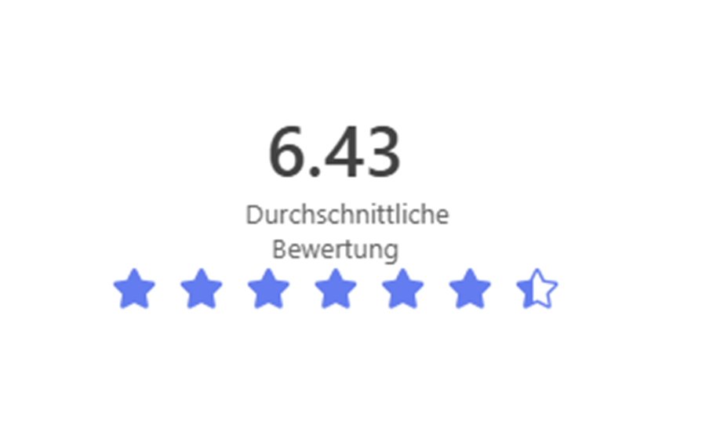
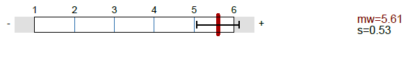
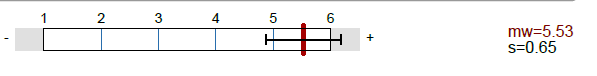
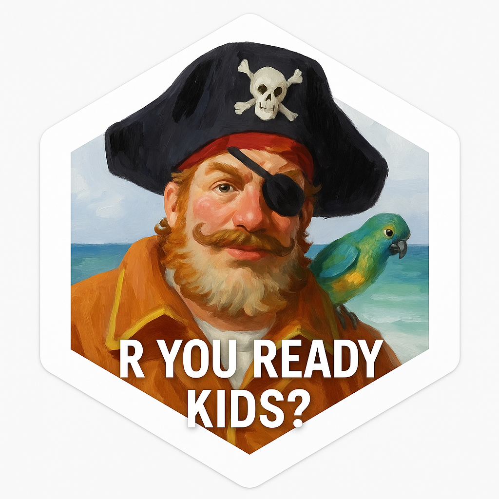

# Recap Methodenberatung & R You Ready HS25

------------------------------------------------------------------------

## Methodenberatung

-   **29** consultations since September

-   Predominantly Master's students – providing thesis support

-   Spread through WhatsApp, lecturers, and word of mouth

-   Sign up through Website with a Booking Tool

-   Preparation time between 15 min - 4-5 Hours

**Feedback: Positive!**

{width="209"}

------------------------------------------------------------------------

## Request Spectrum

-   "I need help with the R GUI to open a new script"

-   "I need help with analysis XYZ" ranging from simple to very complex

-   Students often have `existing code`!

    -   Need help organizing it
    -   Want someone to double-check
    -   General insecurity about whether they are "doing it right"

------------------------------------------------------------------------

## What worked well

-   Data Management & Initial Processing ("Where do i get started")

-   Technical Troubleshooting

-   Briding the gap between concept and code

-   Early-Stage Conceptual Guidance (e.g., "How do I approach this?")

➡️Early Stage Help often proved to be productive!

------------------------------------------------------------------------

## Challenges

-   Late Stage Support Bottlenecks

    -   Often hard to figure out what the Problem is in the first place

    -   Underspecified Requests + Ghosting when asked

-   Reproducibility!

    -   Lots and Lots of Code

    -   Rarely Reproducible, Unstructured, Vibecoded

    -   However: R YOU READY seems to help!

------------------------------------------------------------------------

## Challenges (2)

-   Research Integrity Risks

    -   QRPS!

    -   No preregistration ever

-   Time consuming validation

    -   High demand for code reviews

    -   Very time consuming

-   Methodological Overcomplexity

    -   Unjustified analyses, excessive use of moderations and mediations
    -   Vibe analytics - "ChatGPT - how do i analyse this data".

------------------------------------------------------------------------

## Institutional Issues

-   **Supervision often appears insufficient or non-existent.**

-   Examples

    -   Supervisors who only care about data collection.

    -   Supervisors being unreachable

    -   Supervisors quit and no adequate replacement is provided

    -   Supervisors actively recommending QRPs.

    -   Students who are clearly neither motivated nor interested in doing research and see it as a "necessary evil."

    -   Attempting to answer a RQ does not seem required - Doing something for the sake of doing it seems sufficient

------------------------------------------------------------------------

## My Personal Takeaways

-   Focusing on low-level support is the most productive and time-efficient
-   Decline more requests that require too much preparation!
-   Very Basic Method Skills go a long way

Therefore...

------------------------------------------------------------------------

# R YOU READY 🤩

Reproducible Data Wrangling and Analysis in R

{fig-align="center" width="243"}

------------------------------------------------------------------------

## Changes in HS2025

-   Integration of pre-existing Resources & Structure

<!-- -->

-   Shift to a modular [Quarto website](https://r-you-ready.github.io/HS2025/)

    -   Improved Structure

    -   Integration of Slides, PDFs, Data, Code ect.

-   Individual simulated data

    -   Partly simulated with `truffle` (Thanks Ian!)

-   Shiny app for individual solutions

    -   Integrates into Website

------------------------------------------------------------------------

## Slides made with Quarto! {background="#43464B"}

-   Are annoying to use at first but offer a lot of benefits in the long run!

-   Integrate very nicely into the Website and the general workflow!

```{r}
#| echo: true
#| output-location: slide
library(ggplot2)
ggplot(airquality, aes(Temp, Ozone)) + 
  geom_point() + 
  geom_smooth(method = "loess")
```

::: footer
Learn more: [Slide Backgrounds](https://quarto.org/docs/presentations/revealjs/#color-backgrounds)
:::

------------------------------------------------------------------------

## Tabsets {.smaller .scrollable transition="slide"}

::: panel-tabset
### Plot

```{r}
library(ggplot2)
ggplot(mtcars, aes(hp, mpg, color = am)) +
  geom_point() +
  geom_smooth(formula = y ~ x, method = "loess")
```

### Data

```{r}
knitr::kable(mtcars)
```
:::

::: footer
Learn more: [Tabsets](https://quarto.org/docs/presentations/revealjs/#tabsets)
:::

------------------------------------------------------------------------

## Feedback:

-   Very Positive! (Stickers helped).

 

-   Website was generally appreciated, but clarity and Structure can be improved

-   Individual Data set & Simulation; Proof of concept that needs fine tuning

------------------------------------------------------------------------

## Future Opportunities

-   Integrating More Shinyapps like [*learnR*](https://r-you-ready.github.io/HS2025/LearnR.html)
-   Expanding the Simulated Datasets
-   Automated Feedback?

------------------------------------------------------------------------

## Future Opportunities

-   Changing the Logo to the [Spongebob Pirate](https://www.youtube.com/watch?v=7EBMGEl8WEg)

{fig-align="center" width="349"}
